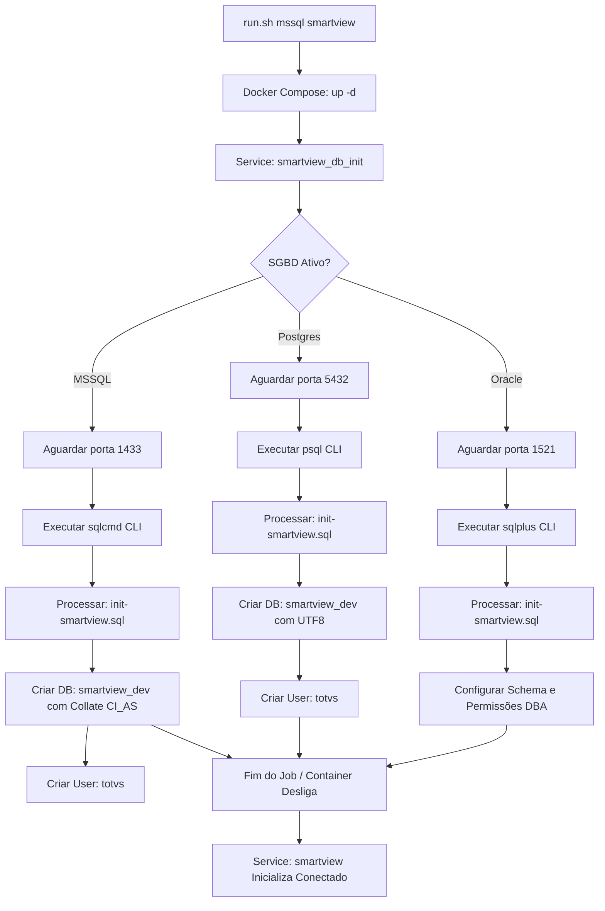

# TOTVS SmartView - DevOps Infra Tools Engine (`infra-tools-dev`)

Repositório oficial para construção e empacotamento da imagem utilitária de provisionamento e controle da malha de banco de dados do **TOTVS SmartView** (`rodrigomicrosiga/smartview-infra-tools-dev`).

---

## 🏗️ Visão Geral & Fluxo de Provisionamento

Esta imagem utilitária atua como um container *sidecar* de inicialização rápida (`smartview_db_init`) na inicialização do ambiente do desenvolvedor, garantindo que o banco de dados dedicado do SmartView seja criado de forma dinâmica e automatizada, respeitando estritamente o SGBD ativo na stack principal (`Postgres`, `MSSQL` ou `Oracle`).



### 🛠️ Tecnologias Integradas na Imagem

* `Debian Slim`: Sistema operacional base de alta segurança e pegada minimalista.

* `Microsoft sqlcmd (v18)`: Ferramenta nativa para provisionamento rápido e seguro em instâncias do SQL Server.

* `PostgreSQL Client (psql)`: Client oficial do Postgres para comandos relacionais e scripts dinâmicos de inicialização.

* `Oracle Instant Client` / `SQLPlus`: Suporte a conexões exclusivas com PDBs Oracle.

### 🚀 Como Executar Localmente via Stack Protheus

Esta imagem é consumida de forma automática pelo repositório principal `docker-protheus-devops-stack` através do orquestrador unificado:

```bash
./run.sh mssql smartview
```


